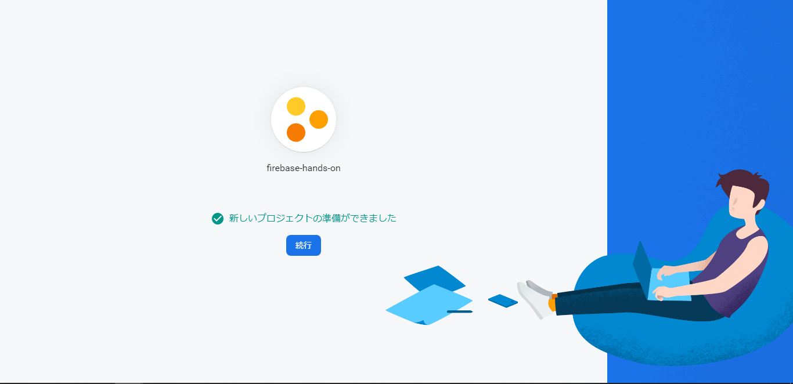
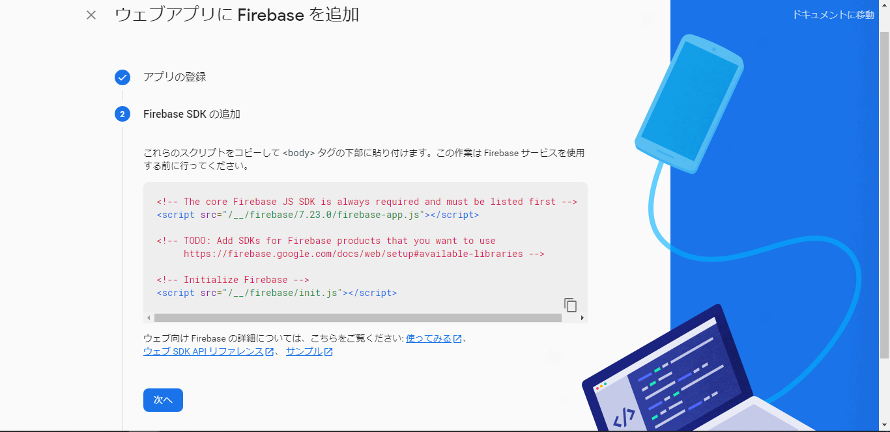
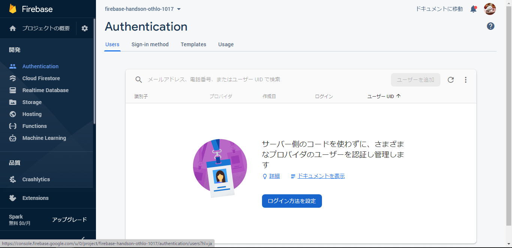
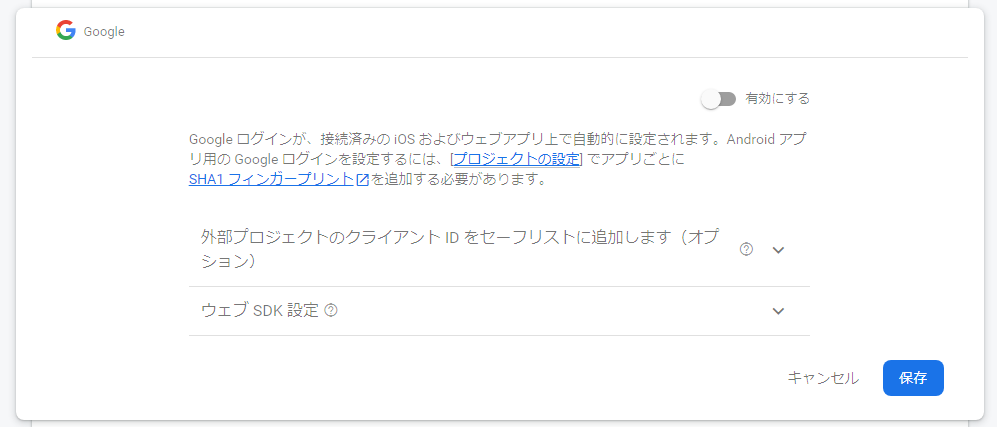
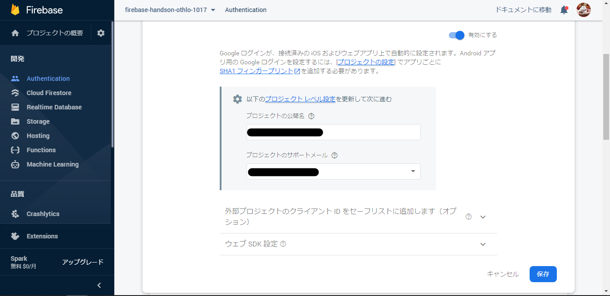
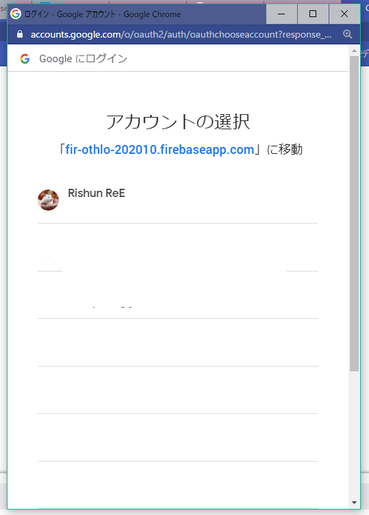
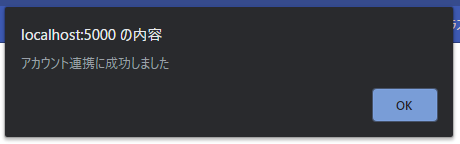

author: ReERishun
summary: 【クラウド超入門】JS初心者向けFirebaseハンズオン
id: handson-firebase-vanilla-js
categories: codelab,markdown
environments: Web
status: public
feedback link: https://github.com/ree-rishun/handson-firebase-vanilla-js
analytics account:

# 【クラウド超入門】JS初心者向けFirebaseハンズオン

## Firebaseとは？
Duration: 0:03:00


### 今回学ぶ製品
Firebaseには18個以上の製品があります。
今回はその中から3つ利用します。

### Firebase Authentication

Firebase Authenticationは、SNSなどの会員情報を用いた認証をアプリケーションに導入できます。

[Firebase Authentication - Firebase](https://firebase.google.com/docs/auth?hl=ja)

### Firebase Hosting

Firebase Hostingは、作成したWebアプリケーションを簡単にホスティングできるサービスです。

[Firebase Hosting - Firebase](https://firebase.google.com/products/hosting?hl=ja)

### Realtime Database

Realtime Databaseはリアルタイムでデータを共有/同期できるNoSQLのデータベースです。

[Firebase Realtime Database - Firebase](https://firebase.google.com/products/realtime-database?hl=ja)
[NoSQLについて勉強する。 - Qiita](https://qiita.com/t_nakayama0714/items/0ff7644666f0122cfba1)

## 新規プロジェクトの作成（GUIの場合）
Duration: 0:10:00

それでは、最初に新規のプロジェクトを作成します。
まずは下記ボタンからコンソールを開いてください。

<button>
  [Firebaseコンソールへ移動](https://console.firebase.google.com/)
</button>

以下の画面が表示されたかと思いますので、**[プロジェクトの作成]**をクリックしてください。


### プロジェクト名の指定
プロジェクト名を決めます。
基本的に半角英数字で指定してください。


尚、「-!'"」の記号は使用できます。


### Googleアナリティク
アナリティクスをOFFにしてください。
その後、[続行]を押して下さい。


### 作成完了
下の画面のようにプロジェクトの作成が完了したら[続行]を押してください。




## Webアプリの追加（GUIの場合）
Duration: 0:05:00

Webアプリケーションを追加します。
プロジェクトのホーム画面からWebのロゴをクリックしてください。


名前を指定して、[このアプリのFirebase Hostingも設定します。]にチェックを入れます。


FirebaseSDKを追加します。
表示されているスクリプトをコピーしてください。



index.htmlのhead内の「Firebase SDKの追加部分」にペーストしてください。

```html
<!DOCTYPE html>
<html>
  <head>
    <meta charset="utf-8">
    <meta name="viewport" content="width=device-width, initial-scale=1">
    <title>Welcome to Firebase Hosting</title>

    <!-- Firebase SDKの追加部分 開始 -->
    <!-- The core Firebase JS SDK is always required and must be listed first -->
    <script src="/__/firebase/7.23.0/firebase-app.js"></script>

    <!-- TODO: Add SDKs for Firebase products that you want to use
        https://firebase.google.com/docs/web/setup#available-libraries -->

    <!-- Initialize Firebase -->
    <script src="/__/firebase/init.js"></script>
    <!-- Firebase SDKの追加部分 終了 -->

    <link rel="stylesheet" href="./css/style.css">
  </head>
```

続いてFirebaseCLIのインストールについて出てきますが、こちらは事前準備の際に行っていただいた内容になりますので、そのまま次に進んでいただいて大丈夫です。


続いてもひとまず飛ばして、コンソールへ進んでください。


これで、FirebaseへのWebアプリケーションの追加が完了しました。


## テンプレートのダウンロード
Duration: 0:03:00

今回は、1からCSSやHTMLを書いていくのは大変ですので、こちらで用意したプロジェクトを基に開発していただきます。
GitHub上にコードが置いてあるので、GitHubを利用したことのある方は、cloneをお願い致します。

### GitHubを利用されている方

任意のディレクトリにてクローンしてください。

```
git clone git@github.com:OthloTech/firebase-hands-on.git
```

### GitHubを利用されていない方

まずは、以下のサイトにアクセスしてください。

[OthloTech/firebase-hands-on - GitHub](https://github.com/OthloTech/firebase-hands-on)

続いて、緑色のcodeボタンを押して、「Download ZIP」を押してZIPファイルをダウンロードしてください。


ダウンロードした zipファイルを開き、中のプロジェクトを任意のディレクトリにペーストしてください。

## Firebase CLIへのログイン


## サーバとデプロイ
Duration: 0:05:00

今回利用するFirebaseHostingには開発したアプリケーションを簡単にデプロイできるコマンドが用意されています。

```
$ firebase deploy
```

コマンド実行後、デプロイが完了すると以下のようにURLがコンソールに表示されます。

```
Hosting URL: https://xxxxxxxxxxx.web.app
```

xx～の部分には最初に指定したプロジェクトのIDが入っており、このページにアクセスすると実際に開発したものが確認できます。

しかし、毎回デプロイせずともローカルでもしっかりと確認したいですよね？
その場合は以下のコマンドでローカルでも確認できます。

```
$ firebase serve
```

今回のハンズオンでは基本的にローカルでの確認を行いながら進めていきます。

## Authenticationの設定
Duration: 0:05:00

Authentication（認証機能）の設定を行います。
今回はGoogleアカウントによる認証のみに対応させます。

左側のナビゲーションから**Authentication**を選択し、**Sign-in method**のタブを開いてください。



認証方法の一覧が表示されますので、Googleをクリックして下さい。



表示されたら、

1. **有効にする**をONに
2. **プロジェクトのサポートメール**を選択
3. **保存**を押してください。



以上で Authentication の設定は完了です。

## FirebaseのSDKの読み込み
Duration: 0:02:00

Firebase用のSDKを追加します。
`public/index.html` を開き、以下のように `<!-- FirebaseのSDK追加部分 -->` の部分にSDKを追加してください。

```html
<!DOCTYPE html>
<html>
<head>
  <meta charset="utf-8">
  <meta name="viewport" content="width=device-width, initial-scale=1">
  <title>ChatApp</title>

  <!-- FirebaseのSDK追加部分 開始 -->
  <script defer src="/__/firebase/7.23.0/firebase-app.js"></script>
  <script defer src="/__/firebase/7.23.0/firebase-auth.js"></script>
  <script defer src="/__/firebase/7.23.0/firebase-database.js"></script>
  <script defer src="/__/firebase/init.js"></script>
  <!-- FirebaseのSDK追加部分 終了 -->

  <link rel="stylesheet" href="./css/style.css">
  <link href="https://fonts.googleapis.com/css2?family=Noto+Sans+JP&display=swap" rel="stylesheet">
</head>
```

`/__/firebase/firebase-app.js` と `/__/firebase/init.js` は必ず必要ですが、`/__/firebase/7.23.0/firebase-auth.js` や `/__/firebase/7.23.0/firebase-database.js` は利用するプロダクトを追加していますので、プロジェクトによって呼び出す製品は変わってきます。

## 認証処理の作成
Duration: 0:10:00

それでは、認証処理を実装していきます。

### 認証処理の作成

`public/js/auth.js` へ以下のコードを追加します。

```javascript
// 認証処理作成箇所
function auth() {
  // TODO: Googleプロバイダオブジェクトのインスタンスを作成
  const provider = new firebase.auth.GoogleAuthProvider();

  // TODO: Google認証のポップアップ表示
  firebase
    .auth()
    .signInWithPopup(provider)
    .then((result) => { // 認証成功
      // TODO: ユーザ情報の更新関数

      // モーダルを非表示にする
      document.getElementById('signin_modal_layout').style.display = 'none';

      // ページ情報を読み込む
      pageInit();
    })
    .catch(function (error) { // 認証失敗
      alert("アカウント連携に失敗しました");
      console.log({ error });
    });
}
```

ここでは、Google認証のポップアップを呼び出し認証を行った結果を受け取ります。

１． Googleプロバイダオブジェクトのインスタンスを作成

```javascript
  // TODO: Googleプロバイダオブジェクトのインスタンスを作成
  const provider = new firebase.auth.GoogleAuthProvider();
```

２． 認証処理

```javascript
  firebase
    .auth()
    .signInWithPopup(provider)
    .then((result) => { // 認証成功
      // ユーザ情報の更新
      updateUserinfo(result.user);

      // モーダルを非表示にする
      document.getElementById('signin_modal_layout').style.display = 'none';

      // ページ情報を読み込む
      pageInit();
    })
    .catch(function (error) { // 認証失敗
      alert("アカウント連携に失敗しました");
      console.log({ error });
    });
```

３． 成功した場合、認証結果（ユーザ情報）を受け取る

```javascript
    .then((result) => { // 認証成功
      // ユーザ情報の更新
      updateUserinfo(result.user);

      // モーダルを非表示にする
      document.getElementById('signin_modal_layout').style.display = 'none';

      // ページ情報を読み込む
      pageInit();
    })
```

４． 失敗した場合、エラーをアラートにて表示

```javascript
    .catch(function (error) { // 認証失敗
      alert("アカウント連携に失敗しました");
      console.log({ error });
    });
```

### ログインボタンを作成する

ログイン用のモーダルを追加します。
39行目に以下のコードを追記してください。

`public/index.html`
```javascript
  <!-- TODO: ログインモーダルを追加 -->
  <div id="signin_modal_layout">
    <div id="signin_modal">
      <h2>Googleアカウントでログイン</h2>

      <button
        class="submit_button"
        onclick="auth()">
        Googleでサインイン
      </button>
    </div>
  </div>
```

このコードにより、ページを読み込むたびに認証を行うようになりました。

### ログインしてみる

それでは、ローカルで動作チェックしてみましょう。
以下のコマンドを実行してローカルでアプリを起動してください。

```
$ firebase serve
```

続いて、localhost:5000にアクセスしてください。

<button>
  [ローカルでテスト](http://localhost:5000)
</button>

すると、早速ポップアップがブロックされてしまい認証が失敗してしまいます。


リンクバーにあるポップアップブロックのアイコンをクリックし、**http://localhost:5000 のポップアップとリダイレクトを常に許可する**にチェックを入れ、**完了**を押してください。


すると、画像のようにアカウント一覧が表示されるかと思います。



自身のアカウントを選択し、ログインしてください。
以下のようにポップアップが表示されればログイン成功です！




## ユーザ情報の格納
Duration 00:10:00

ユーザが登録された際に合わせてFirestoreへデータを格納する処理を追加します。

`public/js/auth.js`に以下の処理を追加します。

```javascript
// ユーザ情報登録/更新
function updateUserinfo(user) {
  // TODO: Firestoreオブジェクトのインスタンスを作成
  const  db = firebase.firestore();

  // TODO: DBにユーザ情報を登録
  db.collection("users").doc(user.uid).set({
    uid: user.uid,                  // UID
    displayName: user.displayName,  // 表示名
    photoURL: user.photoURL         // アイコン
  })
    .then(() => { // 成功時
      console.log("Document successfully written!");
    })
    .catch((error) => { // 失敗時
      console.error("Error writing document: ", error);
    });
}
```

ここでは、 `set()` メソッドを用いて、値をデータベースへ格納しています。
セットした値は users/XXXXXX(ユーザID) に格納されます。
もし既に同じユーザIDが格納されている場合は上書されます。

また、先程追加したコードも一部修正します。

```javascript
// 認証処理作成箇所
function auth() {
  // TODO: Googleプロバイダオブジェクトのインスタンスを作成
  const provider = new firebase.auth.GoogleAuthProvider();

  // TODO: Google認証のポップアップ表示
  firebase
    .auth()
    .signInWithPopup(provider)
    .then((result) => { // 認証成功
      // TODO: ユーザ情報の更新関数
      updateUserinfo(result.user);

      // モーダルを非表示にする
      document.getElementById('signin_modal_layout').style.display = 'none';

      // ページ情報を読み込む
      pageInit();
    })
    .catch(function (error) { // 認証失敗
      alert("アカウント連携に失敗しました");
      console.log({ error });
    });
}
```

追加が完了後、再度 localhost:5000 へアクセスしログインしてみてください。

ログインが完了したら、Firebaseのコンソールへアクセスし、**Realtime Database** を開いてください。
以下のように usersドキュメントが追加されていればOKです。


## サブスクの新規作成
Duration 00:05:00

`public/js/firestore.js`へ以下を追加してください。

```javascript
// サブスクの新規追加処理
function addSubsc() {
  const form = document.forms['add_form'].getElementsByTagName("input");

  // TODO: ログイン中のユーザ情報を取得
  const user = firebase.auth().currentUser;

  // TODO: Firestoreオブジェクトのインスタンスを作成
  const  db = firebase.firestore();

  // TODO: サブスクの新規追加とユーザ情報への追加
  db.collection('subscription').add({
    title: form['title'].value, // サブスク名
    price: form['price'].value  // 価格
  })
    .then((docRef) => { // 成功した場合
      // ユーザのサブスク一覧に追加
      db.collection('users').doc(user.uid).collection('subscription').doc(docRef.id).set({
        id: docRef.id,
        startedAt: form['startedAt'].value
      });

      // ページの表示を変更する
      pageInit();

      // モーダルを閉じる
      switchAddModal();
    })
    .catch((error) => { // 失敗した場合
      console.error("Error adding document: ", error);
    });
}
```

## サブスクの一覧取得
Duration 00:05:00

`public/js/firestore.js`へ以下を追加してください。

```javascript
// サブスクの一覧を取得
function printSubscription() {
  // 一覧の追加先エレメントを変数へ格納
  const user = firebase.auth().currentUser;

  // サブスク一覧リストを初期化
  subscription_list = {};

  // TODO: Firestoreオブジェクトのインスタンスを作成
  const  db = firebase.firestore();

  // TODO: サブスクの一覧を取得
  db.collection('users')
    .doc(user.uid).collection('subscription')
    .get().then((querySnapshot) => {
    querySnapshot.forEach((doc) => {
      // 取得したサブスクを1個ずつ処理
      db.collection('subscription').doc(doc.data().id).get()
        .then((subsc_doc) => {
          if (doc.exists) { // ドキュメントが取得できたとき
            // 開始日の日付のみを取得
            const day = new Date(doc.data().startedAt);

            // サブスク一覧に格納
            subscription_list[doc.data().id] =
              {
                id: doc.data().id,
                title: subsc_doc.data().title,
                price: subsc_doc.data().price,
                day: ( '00' + day.getDate() ).slice( -2 ),
                startedAt: doc.data().startedAt,
                type: 'month',
              }
          } else {  // ドキュメントが見つからなかった場合
            console.log("No such document!");
          }
        }).catch((error) => {
        console.log("Error getting document:", error);
      })
        .then(() => {
          updateList();
        })
    });
  });
}

```

## サブスクの情報を編集
Duration 00:05:00

`public/js/firestore.js`へ以下を追加してください。

```javascript
// 編集結果の保存
function saveEdit(id) {
  // フォームを取得
  const form = document.forms['edit_form'].getElementsByTagName("input");
  const  db = firebase.firestore();

  // TODO: サブスクの情報を更新
  db.collection('subscription').doc(id).update({
    title: form['title'].value, // サブスク名
    price: form['price'].value  // 価格
  })
    .then((docRef) => { // 成功した場合
    })
    .catch((error) => { // 失敗した場合
      console.error("Error adding document: ", error);
    });

  // ページ内のコンテンツをリフレッシュ
  pageInit();

  // 非表示にする
  document.getElementById('edit_modal_layout').style.display = 'none';
}
```

## サブスクの削除
Duration 00:05:00

`public/js/firestore.js`へ以下を追加してください。

```javascript
function subsc_cancel(id) {
  // TODO: ログイン中のユーザ情報を取得
  const user = firebase.auth().currentUser;

  // TODO: Firestoreオブジェクトのインスタンスを作成
  const  db = firebase.firestore();

  // TODO: サブスクをFirestoreから削除する
  db.collection('subscription').doc(id).delete().then(() => {
    console.log("Document successfully deleted!");
  }).catch((error) => {
    console.error("Error removing document: ", error);
  });

  // TODO: サブスクのIDをユーザ情報から削除する
  db.collection('users').doc(user.uid).collection('subscription').doc(id).delete().then(() => {
    console.log("Document successfully deleted!");
  }).catch((error) => {
    console.error("Error removing document: ", error);
  });

  // ページ内のコンテンツをリフレッシュ
  pageInit();

  // 非表示にする
  document.getElementById('edit_modal_layout').style.display = 'none';
}
```

## まとめ
Duration 00:05:00

ハンズオンお疲れ様でした。

今回のハンズオンでは、Firebaseの機能としては、

- Firebase CLI
  - Firebaseをコマンドラインで作成 / 編集 / 操作できるツール
- Firebase Hosting
  - Webアプリをデプロイできる
- Firebase Authentication
  - 認証を導入できる
- Firestore
  - CRUDできる

を実際に使用しました。

また、Firestoreでは以下の4つのメソッドを使用しました。

- `set()` : 
- `get()` : 
- `update()` : 
- `delete()` : 

Firebaseの機能は勿論これだけではありません。
ただ、一部分を触っただけでもわかる通り、簡単に実装でき、高品質のアプリケーションを開発することが可能です。
趣味の開発やハッカソンやコンテスト等で導入してみてはいかがでしょうか？


## 参考にした記事
Duration: 0:01:00

- [Firebase Realtime Database で Cloud Firestore を使用する - Firebase](https://firebase.google.com/docs/firestore/firestore-for-rtdb?hl=ja)
- [データベースを選択: Cloud Firestore または Realtime Database](https://firebase.google.com/docs/database/rtdb-vs-firestore?hl=ja)
- [Firebase Realtime DatabaseとFirestoreを使い分けていこうなという話 - KAYAC](https://techblog.kayac.com/rtdb-vs-firestore)
